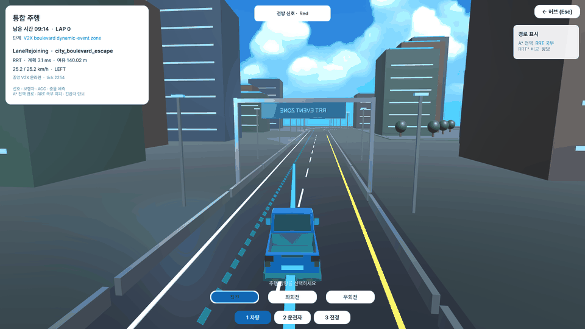
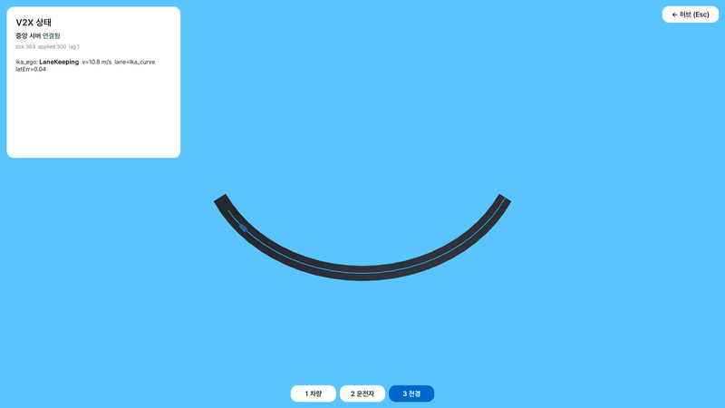
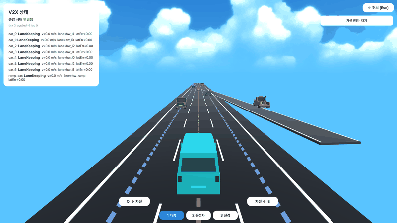
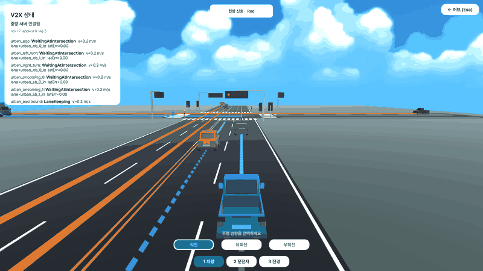
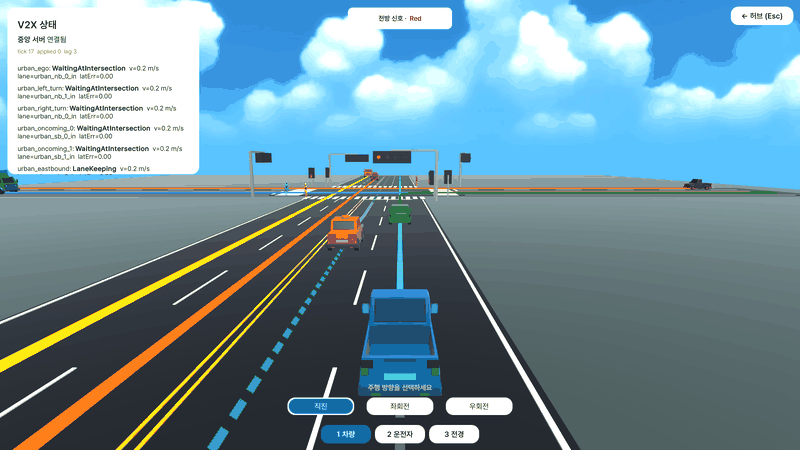
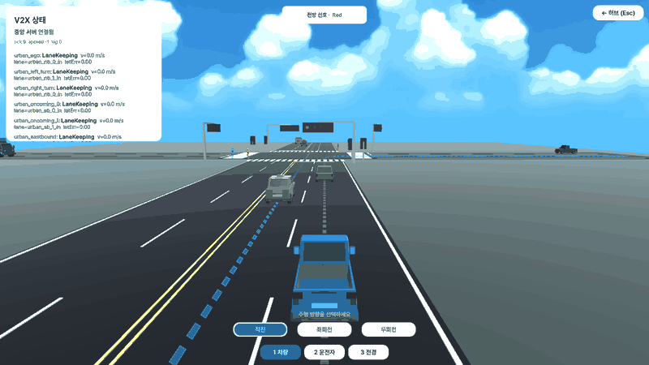
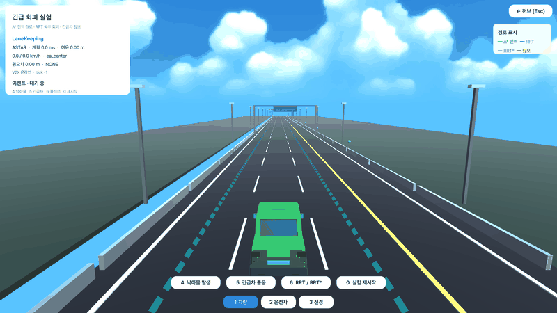

# 중앙 집중형 V2X 자율주행 시뮬레이터

중앙 서버가 차량, 보행자, 장애물의 위치와 운동 상태를 실시간으로 수신하는 환경을
가정한 다차량 주행 시뮬레이터다. 전역 상태 관리, 경로 계획, 충돌 예측, 교통 정책,
차량 제어를 구현했다. 카메라·LiDAR 인지와 센서 융합은 범위에 포함하지 않았다.

Unity는 도로, 차량 운동, 시나리오 및 UI를 담당한다. Python 서버는 월드 모델, 경로
계획, 행동 결정 및 차량별 제어 명령을 담당한다.



*IntegratedCity 실제 실행 화면. Python 중앙 서버에 연결한 Unity Game View를 캡처했다.*

## 프로젝트 요약

| 항목 | 현재 구성 |
|---|---|
| 구현 범위 | Main 허브 1종, 주행 씬 5종, 최대 동시 차량 8대 |
| 핵심 기술 | A\*, RRT, RRT\*, ACC, Pure Pursuit, Stanley, PID |
| 개발 환경 | Unity 6000.3.21f1 · C#, Python 3.14.4 |
| 통신 | WebSocket `localhost:8765`, JSON Schema Draft-07, 명목 25 Hz |
| 검증 결과 | 테스트 259건 수집, 257 pass, 2 skip |
| 계측 결과 | Python `step()` p50 0.06–0.74 ms, 최대 p95 1.40 ms |

### 문서 안내

| 구분 | 바로가기 |
|---|---|
| 설계 | [시스템 구성](#1-시스템-구성) · [통신 및 데이터 규약](#2-통신-및-데이터-규약) · [기술 명세](#3-기술-명세) |
| 구현 | [씬 구성](#4-씬-구성) |
| 결과 | [실험 결과](#5-실험-결과) · [검증 및 제한사항](#6-검증-및-제한사항) |
| 사용 | [실행 방법](#7-실행-방법) · [저장소 구성](#8-저장소-구성) · [참고문헌](#9-참고문헌) |

## 1. 시스템 구성

### 1.1 범위

| 구분 | 내용 |
|---|---|
| 가정 | 중앙 서버가 모든 이동체의 위치·속도·가속도를 오차와 지연 없이 수신 |
| 분석 대상 | 다차량 경로 계획, 충돌 회피, 합류, 신호 교차로, 횡방향·종방향 제어 |
| 제외 | 카메라·LiDAR 인지, 센서 융합, 타이어·서스펜션 동역학, 실차 이식 |
| 좌표계 | Unity 월드 좌표, m, yaw 0° = +Z, 시계 방향 증가 |

### 1.2 처리 계층

```text
Unity
├─ Road / Lane Network
├─ Vehicle Physics and Controllers
├─ Scenario Directors
├─ V2XClient
└─ Scene UI
       │ StateMessage
       ▼
Python Server
├─ WorldModel
├─ Collision Predictor
├─ Global / Local Planners
├─ Traffic, Merge, Left-turn, Avoidance Policies
└─ ACC / Lateral Controllers
       │ CommandMessage
       ▼
Unity VehicleController
```

한 번의 서버 제어 주기는 다음 순서로 실행된다.

```text
상태 수신 → tick 검사 → 월드 모델 갱신 → 충돌 예측
→ 전역/국부 경로 계획 → 교통 정책 → 목표 속도·경로 생성 → 명령 송신
```

| 기능 | Unity | Python |
|---|:---:|:---:|
| 도로·차선 형상 편집 | ● | |
| 차량 운동·조향 적용 | ● | |
| 월드 모델·충돌 예측 | | ● |
| 경로 계획·행동 결정 | | ● |
| 신호 상태 표시 | ● | |
| 신호 정책 집행 | | ● |

## 2. 통신 및 데이터 규약

`shared/protocol/`의 JSON Schema를 Unity와 Python이 공통으로 사용한다.

| 방향 | 스키마 | 주요 데이터 |
|---|---|---|
| Unity → Python | [`state_message.schema.json`](shared/protocol/state_message.schema.json) | `time`, `tick`, `scenario`, `vehicles`, `objects`, `events` |
| Python → Unity | [`command_message.schema.json`](shared/protocol/command_message.schema.json) | `time`, `tick`, `vehicle_id`, `target_speed`, `path`, `behavior`, `planner` |

- Unity 고정 스텝은 0.02 s이며 2 tick마다 상태를 송신한다. 명목 송신
  주기는 0.04 s(25 Hz)다.
- `CommandMessage.time`과 `tick`은 응답 대상 `StateMessage`의 값을 반환한다.
- 이전 tick 명령, 순서가 뒤바뀐 명령, 씬 재시작 전 상태는 폐기한다.
- 차선 그래프는 Unity에서 export하고 Python의 `LaneNetwork`가 로드한다.

상세 규약: [`docs/api_protocol.md`](docs/api_protocol.md)

## 3. 기술 명세

### 3.1 경로 계획·충돌 예측

| 구성 | 적용 범위 | 주요 설정 |
|---|---|---|
| A\* | 차선 그래프 전역 경로 | 차선 길이 비용, 직선거리 휴리스틱, 교차로 후보 최대 4개 |
| RRT | 돌발 장애물 국부 회피 | step 3.0 m, goal bias 0.22, 1,800 iterations, 45 ms 예산 |
| RRT\* | 국부 경로 품질 비교 | 1,200 iterations, rewire 8 m, 140 ms 예산 |
| 경로 후처리 | RRT/RRT\* 출력 | 0.5 m 충돌 검사, 2 m 재샘플, 최대 꺾임각 78° |
| 충돌 예측 | 모든 이동체 쌍 | 4.0 s 지평선, 중심 간 안전거리 2.5 m, 해석적 TTC 계산 |

RRT/RRT\*의 탐색 공간은 현재 차선, 인접 차선 및 후속 차선으로 구성한
코리도로 제한한다. 타 차량은 3 s 예측 궤적과 2.45 m 점유 반경,
장애물은 반경에 1.45 m를 더해 탐색 공간에 반영한다.

### 3.2 교통 정책

| 기능 | 방법 | 주요 조건 |
|---|---|---|
| ACC | 일정 차두시간 + 안전속도 제한 | 차두시간 2.0 s, 정지간격 6.0 m, 가속 2.0 m/s², 감속 4.0 m/s² |
| 충돌 대응 | TTC 기반 행동 선택 | 긴급제동 1.5 s 이하, 정지 3.0 s 이하 |
| 합류 예약 | 합류점 ETA 정렬 및 본선 감속 | 필요 간격 2.0 s, 상류 관측 250 m, 최소 합류 속도 5.0 m/s |
| 차선 변경 | lead/lag 간격 판정 | 수용 시간간격 1.5 s |
| 보호 좌회전 | 좌회전 차선 진입, 화살표 대기, 교차로 통과 | gap 1.25 s, 충돌 확인 35 m, 보행 통로 반폭 3 m |
| 긴급차 양보 | 최우측 갓길 대피 | 탐지 60 m, 양보 속도 3.0 m/s |

신호 교차로는 60 s 고정 주기를 사용한다. 동서 직진, 보행, 남북 직진,
보호 좌회전, 보행 순으로 진행하며 황색·전적색 버퍼를 포함한다.
적신호 우회전은 완전 정지 후 보행자와 교차 교통에 양보하도록 구현했다.

### 3.3 횡방향 제어

| 제어기 | 수식·입력 | 미조정 기본값 |
|---|---|---|
| Pure Pursuit | 전방주시점 기하 추종 | lookahead `4.0 + 0.4v`, 최대 조향 0.6 rad |
| Stanley | 헤딩오차 + 횡오차 | `k=1.5`, `k_s=1.0` |
| PID | 횡오차 되먹임 | `kp=0.12`, `ki=0`, `kd=0.4` |

모든 제어기는 부호 있는 횡오차, 헤딩오차 및 Menger 곡률을 CSV에 기록한다.
이득은 조정 전 기본값이며, §5.2의 결과는 해당 조건에서의 비교다.

## 4. 씬 구성

| 씬 | 구성 | 주요 기능 | 조작 |
|---|---|---|---|
| `Main` | 씬 선택 허브 | 목적·기술·조작 안내, 씬 로드 | `1–5`, `Enter` |
| `LKA_Test` | 반경 90 m 단일 곡선, 차량 1대 | 횡방향 제어, Frenet 오차 계측 | `1–3` 카메라 |
| `Highway` | 3차선 본선 300 m, 온램프 | 합류 예약, ACC, 차선 변경 | `Q/E`, `1–3` |
| `Urban` | 4방향 8접근로, 신호·보행자 | 직진, 좌회전, 우회전, 보호 신호 | 주행 전략 토글, `1–3` |
| `EmergencyAvoidance` | 3개 주행 차선 + 갓길 | 낙하물 회피, RRT/RRT\* 비교, 긴급차 양보 | `4`, `5`, `6`, `0` |
| `IntegratedCity` | 교차로, 대로, 순환로 | 신호, 합류, 충돌 예측, 장애물 회피 | 자동 이벤트, `1–3` |

모든 씬에서 `Esc`나 우측 상단 버튼으로 Main에 복귀할 수 있다.

### 4.1 기능 시연

아래 GIF는 Python 서버에 연결한 Unity Game View를 직접 캡처했다. 재생 속도와
프레임 간격은 화면 설명을 위한 값이며, 성능 수치는 §5의 원자료를 기준으로 한다.

#### LKA_Test — 곡선 차선 추종

Stanley 제어 차량이 전경 시점에서 `lka_curve`의 중앙선을 따라 곡선 구간을
주행한다. 방향 보정이 끝난 구간만 담았으며 HUD에서 적용 tick과 횡오차를
확인할 수 있다.



#### Highway — 합류 차량 방향 차선 변경

`car_0`에 온램프가 접속하는 우측 차선 `hw_l2`로 변경을 요청했다. 촬영 시 합류
차량을 24 m 선행시켜 안전 간격을 확보했으며, 중앙 서버의 gap acceptance 이후
`LaneChanging`으로 전환하고 우측 차선에서 합류 차량을 추종한다.



#### Urban — 직진

남북 신호가 적색인 동안 정지선에서 대기한 뒤 녹색에 선행 차량을 따라
`urban_nb_0_straight` 커넥터를 통과한다.



#### Urban — 보호 좌회전

좌회전 차선으로 이동한 뒤 보호 화살표가 열릴 때까지 대기하고
`urban_nb_left` 커넥터에 진입한다.



#### Urban — 우회전

적신호에서 정지·양보한 뒤 교차 교통 간격을 확인하고 `urban_eb_0_out`으로
진출한다. Urban 세 영상은 신호 주기를 짧게 확인할 수 있도록 2.5–3배속으로
캡처했다.



#### EmergencyAvoidance — 낙하물 회피와 긴급차 양보

낙하물 투입 후 `LateralEvading`으로 우측 회피하고, 후방 긴급차 접근 시
`EmergencyBraking`을 거쳐 `LaneRejoining`으로 원 차선에 복귀한다.



#### IntegratedCity — 통합 시나리오

교차로, 순환 대로, A\* 전역 경로, RRT 국부 회피 및 이벤트 구간을 연속 주행한다.


촬영 tick과 파일 정보는 [`docs/videos/capture-log.csv`](docs/videos/capture-log.csv)에
기록했다. 동일한 촬영은
[`ReadmeCaptureTool.cs`](unity/Assets/Scripts/Editor/ReadmeCaptureTool.cs)로 재생성할 수 있다.

### 4.2 UI 규격

| 항목 | 값 |
|---|---|
| 기준 해상도 | 1920×1080, `CanvasScaler` width/height 0.5 |
| 배경 / 패널 / 본문 | `#F5F5F7` / `#FFFFFF` / `#1D1D1F` |
| 조작 강조색 | `#0066CC` |
| 폰트 | Pretendard 1.3.8 Regular / SemiBold |
| 최소 크기 | 본문 16 px, 상태 18 px, 패널 제목 24 px |

폰트 라이선스: [`unity/Assets/Fonts/Pretendard-LICENSE.txt`](unity/Assets/Fonts/Pretendard-LICENSE.txt)

영상 촬영 조건과 정지 화면 파일명은
[`docs/images/README.md`](docs/images/README.md)에 정리했다.

## 5. 실험 결과

모든 표는 `experiments/results/`의 CSV에서 작성했다. 산출물·소스 해시와
실행 환경은 [`manifest.json`](experiments/results/manifest.json)에 기록되어 있다.

### 5.1 A\*, RRT, RRT\*

시드 5개와 질의 묶음 {1, 5, 20}을 순차 실행했다. 아래 표는 20개 질의와 5개
시드를 합산한 100회 실행 결과다. 질의 묶음은 고정 난수열의 앞부분을 공유하므로
서로 독립된 표본이 아니다. 성공은 시작·목표 각 4 m 이내 연결과 모든 경로
간선의 무충돌로 판정했다.

| 시나리오 | 플래너 | 성공률 | 평균 시간 (ms) | 평균 경로장 (m) | 평균 노드 |
|---|---|---:|---:|---:|---:|
| road_open | A\* | 100% | 0.36 | 233.8 | 8 |
| road_open | RRT | 100% | 0.05 | 164.3 | 1 |
| road_open | RRT\* | 100% | 456.9 | 168.5 | 1501 |
| road_detour | A\* | 0% | 0.07 | — | 1 |
| road_detour | RRT | 100% | 0.50 | 112.8 | 60 |
| road_detour | RRT\* | 100% | 553.3 | 96.7 | 1499 |
| obstacle_field | A\* | 0% | 0.07 | — | 1 |
| obstacle_field | RRT | 100% | 0.99 | 112.2 | 64 |
| obstacle_field | RRT\* | 100% | 739.2 | 97.0 | 1456 |

- A\*는 차선 그래프에서 통행 방향을 보존한다. `road_open`의 RRT 경로는
  격자를 질러가므로 도로 주행 경로로 해석하지 않는다.
- A\*는 대체 간선이 없는 차선 장애물 조건에서 경로를 생성하지 못했다.
- RRT\*는 장애물 조건에서 RRT보다 짧은 경로를 생성했으나 질의당
  0.5–0.8 s가 필요했다. 현재 40 ms 송신 주기의 온라인 기본값은 RRT다.


### 5.2 횡방향 제어

반경 140 m, 길이 240 m 합성 트랙의 단일 결정론적 실행 결과다. Unity
`LKA_Test` 씬(반경 90 m) 계측값이 아니다.

| 속도 (km/h) | Pure Pursuit RMS (m) | Stanley RMS (m) | PID RMS (m) |
|---:|---:|---:|---:|
| 40 | 0.089 | 0.041 | 0.016 |
| 60 | 0.113 | 0.055 | 0.014 |
| 80 | 0.135 | 0.049 | 0.239 |
| 100 | 0.153 | 0.058 | 0.303 |

Stanley의 RMS 오차는 40–100 km/h에서 0.041–0.058 m였다. Pure Pursuit은
속도 증가에 따라 0.089→0.153 m, PID는 0.016→0.303 m로 증가했다.
모든 조건의 차선 이탈 횟수는 0이었다. 이 결과는 잡음, 초기 오차, 조향 지연
및 Unity 물리를 포함하지 않는다.


### 5.3 씬별 Python 제어 부하

`CentralController.step()`의 벽시계 시간을 씬당 1회 헤드리스로 계측했다.
WebSocket, JSON 직렬화, 스키마 검증, Unity 명령 적용 및 렌더링은 제외했다.

| 시나리오 | 차량 | 시뮬레이션 | p50 / p95 (ms) | 최소 동일차선 간격 (m) | 최소 TTC (s) |
|---|---:|---:|---:|---:|---:|
| LKA_Test | 1 | 40 s | 0.06 / 0.21 | — | ∞ |
| Highway | 4 | 40 s | 0.59 / 0.75 | 10.99 | ∞ |
| Urban | 8 | 120 s | 0.42 / 1.10 | 15.05 | 3.87 |
| EmergencyAvoidance | 2 | 50 s | 0.38 / 0.57 | 30.06 | 1.18 |
| IntegratedCity | 3 | 50 s | 0.74 / 1.40 | 29.13 | 3.12 |

최대 p95 1.40 ms는 명목 40 ms 송신 간격의 3.5%다. 이 비율은 Python 계산
커널에만 해당하며 종단간 응답 시간을 의미하지 않는다. 씬별 raw tick 로그가
없으므로 간격·TTC 요약값은 독립 재집계하지 못한다.

세부 조건: [`experiments/results/README.md`](experiments/results/README.md)

## 6. 검증 및 제한사항

### 6.1 자동 검증

```bash
python -m pytest server/tests -q --junitxml=experiments/results/pytest.xml
python experiments/validate_results.py
```

2026-08-07 실행에서 259건을 수집했고 257건이 통과했다. 2건은 도로가
없는 Main 허브의 차선 export 검사를 건너뛴 결과다. JUnit 스위트 시간은
240.2 s, 외부 wall time은 242 s였다.

검사 범위:

- JSON Schema 및 WebSocket 왕복
- 차선 참조, 인접 대칭성, 접합 연속성, 씬–export 대조
- A\*/RRT/RRT\*, 충돌 예측, ACC, 횡방향 제어
- 합류, 차선 변경, 신호, 좌회전, 보행자, 장애물, 긴급차
- 5개 주행 씬의 헤드리스 회귀 주행
- 실험 행렬, CSV 집계, JUnit 테스트 식별자, 소스·산출물 해시

### 6.2 해석 범위

| 제한 | 영향 |
|---|---|
| 최대 동시 차량 8대 | 수십·수백 대 확장성은 검증하지 않음 |
| 충돌 예측 O(n²) | 대규모 운용에는 공간 분할이 필요 |
| 씬별 부하 단일 실행 | 신뢰구간과 일반 성능 보증 없음 |
| Python `step()`만 계측 | 네트워크·Unity를 포함한 폐루프 지연 미계측 |
| 헤드리스 1차 속도 추종기 | 감속·저크를 승차감 지표로 사용할 수 없음 |
| 횡방향 이득 미조정 | 절대 제어 성능을 일반화할 수 없음 |
| 지연·손실·부분 관측 미포함 | 현실 V2X 통신 환경으로 결과를 확장할 수 없음 |

## 7. 실행 방법

### 7.1 Python 서버

```powershell
cd server
python -m venv .venv
.venv\Scripts\Activate.ps1
pip install -r requirements.txt
python main.py --network scenarios/Urban_lanes.json
```

| 씬 | `--network` |
|---|---|
| LKA_Test | `scenarios/LKA_Test_lanes.json` |
| Highway | `scenarios/Highway_lanes.json` |
| Urban | `scenarios/Urban_lanes.json` |
| EmergencyAvoidance | `scenarios/EmergencyAvoidance_lanes.json` |
| IntegratedCity | `scenarios/IntegratedCity_lanes.json` |

### 7.2 Unity

1. Unity 6에서 `unity/`를 연다.
2. `Assets/Scenes/Main.unity`를 열고 Play Mode를 시작한다.
3. 허브에서 씬을 선택한다.
4. 도로를 수정했다면 `V2X > Export Lane Network...`를 실행한다.

씬 재생성 메뉴:

- `V2X > Build All Demo Scenes`
- `V2X > Build Main Hub`
- `V2X > Restyle All Scene UI`

### 7.3 실험 재생성

```bash
python experiments/run_algorithm_compare.py
python experiments/run_lka_test.py
python experiments/run_scene_stats.py
python experiments/make_charts.py
python -m pytest server/tests -q --junitxml=experiments/results/pytest.xml
python experiments/validate_results.py
```

## 8. 저장소 구성

```text
autonomous-simulator/
├─ unity/Assets/
│  ├─ Scenes/             Main + 5 주행 씬
│  ├─ Scripts/
│  │  ├─ Communication/  WebSocket 클라이언트·메시지
│  │  ├─ Road/           차선 그래프
│  │  ├─ Vehicle/        차량·LKA 제어
│  │  ├─ Sim/            시나리오 및 상태 송신
│  │  ├─ UI/             허브·HUD·조작 UI
│  │  └─ Editor/         씬 빌더·차선 export
│  └─ Resources/Fonts/    Pretendard
├─ server/
│  ├─ main.py             WebSocket·스키마 검증
│  ├─ central_control.py  제어 주기 조율
│  ├─ world_model.py      차선 그래프·동적 상태
│  ├─ planners/           A\*·RRT·RRT\*·회피 공간
│  ├─ controllers/        ACC·횡방향 제어
│  ├─ scenarios/          Unity 차선 export
│  └─ tests/              259건
├─ experiments/              실험 러너·CSV·차트·manifest
├─ shared/protocol/          JSON Schema Draft-07
└─ docs/                     상세 설계·결과·촬영 규격
```

| 문서 | 내용 |
|---|---|
| [`docs/api_protocol.md`](docs/api_protocol.md) | 통신 규약 |
| [`docs/left_turn_behavior.md`](docs/left_turn_behavior.md) | 보호 좌회전 정책 |
| [`docs/emergency_avoidance_plan.md`](docs/emergency_avoidance_plan.md) | 국부 회피 상태 |
| [`docs/experiment_results.md`](docs/experiment_results.md) | 실험 조건·결과 상세 |
| [`experiments/results/README.md`](experiments/results/README.md) | 산출물·해석 범위 |
| [`docs/images/README.md`](docs/images/README.md) | 씬 촬영 규격 |

## 9. 참고문헌

1. P. E. Hart, N. J. Nilsson, B. Raphael, “A Formal Basis for the Heuristic
   Determination of Minimum Cost Paths,” *IEEE Transactions on Systems Science
   and Cybernetics*, 4(2), 100–107, 1968.
   [doi:10.1109/TSSC.1968.300136](https://doi.org/10.1109/TSSC.1968.300136)
2. S. M. LaValle, “Rapidly-Exploring Random Trees: A New Tool for Path Planning,”
   Technical Report, 1998. [PDF](https://lavalle.pl/papers/Lav98c.pdf)
3. S. Karaman, E. Frazzoli, “Sampling-based Algorithms for Optimal Motion
   Planning,” *The International Journal of Robotics Research*, 30(7), 846–894,
   2011. [doi:10.1177/0278364911406761](https://doi.org/10.1177/0278364911406761)
4. R. C. Coulter, “Implementation of the Pure Pursuit Path Tracking Algorithm,”
   CMU-RI-TR-92-01, 1992.
   [CMU Robotics Institute](https://publications.ri.cmu.edu/implementation-of-the-pure-pursuit-path-tracking-algorithm)
5. G. M. Hoffmann, C. J. Tomlin, M. Montemerlo, S. Thrun, “Autonomous Automobile
   Trajectory Tracking for Off-Road Driving: Controller Design, Experimental
   Validation and Racing,” *American Control Conference*, 2296–2301, 2007.
   [doi:10.1109/ACC.2007.4282788](https://doi.org/10.1109/ACC.2007.4282788)
